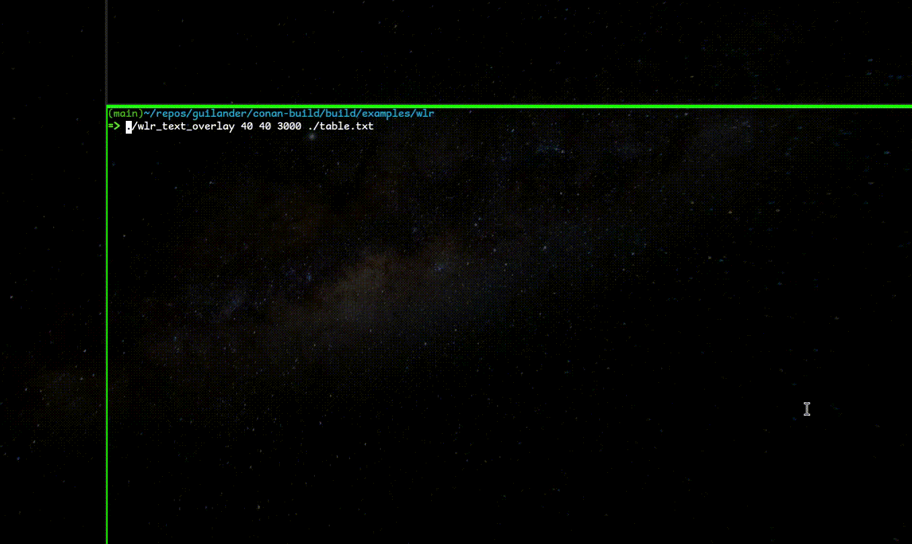

Guilander is a free and minimal Wayland GUI library currently under construction.



Above shows simple text rendering using guilander (see `examples/wlr/`).

# Building tests and examples

## Requirements

Guilander uses C++26 features which have lacking compiler support.
Currently it is tested to work with GCC 15.0.0 20241129 (experimental).

## Dependencies

Guilander depends on:

- [Fontconfig](https://www.freedesktop.org/wiki/Software/fontconfig/)
- [FreeType2](http://freetype.org/)
- [libunistring](https://www.gnu.org/software/libunistring/)
- [waylander](https://github.com/MiroPalmu/waylander)
- [mp-units](https://mpusz.github.io/mp-units/)
- [Kokkos reference implementation of `std::mdspan`](https://github.com/kokkos/mdspan)

Fontconfig, FreeType2 and libunistring are widely available as system packages.
Waylander is downloaded during build configuration using Meson wrap system.
As fallback `subprojects/` also contain wrap files for Fontconfig and FreeType2.

mp-units and Kokkos `std::mdspan` can be installed using
[Conan package manager](https://docs.conan.io/2/).
See Conan [Cmake](https://docs.conan.io/2/tutorial/consuming_packages/build_simple_cmake_project.html#consuming-packages-build-simple-cmake-project)
and [Meson](https://docs.conan.io/2/examples/tools/meson/build_simple_meson_project.html#examples-tools-meson-toolchain-build-simple-meson-project)
tutorials for instructions on how to setup Conan.

## Compilation

After setting up Conan profiles:

```shell
$ conan install . --output-folder=conan-build --build=missing
$ cd conan-build
$ meson setup --native-file conan_meson_native.ini .. build
$ meson compile -C build
$ meson test -C build # Run tests.
```

# Author

Miro Palmu, email@miropalmu.cc
